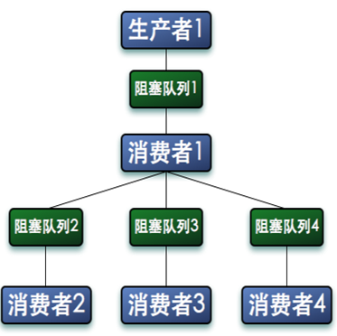

# 聊聊并发（十）生产者消费者模式
在并发编程中使用生产者和消费者模式能够解决绝大多数并发问题。该模式通过平衡生产线程和消费线程的工作能力来提高程序的整体处理数据的速度。

## 为什么要使用生产者和消费者模式
在线程世界里，生产者就是生产数据的线程，消费者就是消费数据的线程。在多线程开发当中，如果生产者处理速度很快，而消费者处理速度很慢，那么生产者就必须等待消费者处理完，才能继续生产数据。同样的道理，如果消费者的处理能力大于生产者，那么消费者就必须等待生产者。为了解决这种生产消费能力不均衡的问题，所以便有了生产者和消费者模式。

## 什么是生产者消费者模式
生产者消费者模式是通过一个容器来解决生产者和消费者的强耦合问题。生产者和消费者彼此之间不直接通讯，而通过阻塞队列来进行通讯，所以生产者生产完数据之后不用等待消费者处理，直接扔给阻塞队列，消费者不找生产者要数据，而是直接从阻塞队列里取，阻塞队列就相当于一个缓冲区，平衡了生产者和消费者的处理能力。

这个阻塞队列就是用来给生产者和消费者解耦的。纵观大多数设计模式，都会找一个第三者出来进行解耦，如工厂模式的第三者是工厂类，模板模式的第三者是模板类。在学习一些设计模式的过程中，如果先找到这个模式的第三者，能帮助我们快速熟悉一个设计模式。

## 生产者消费者模式实战
我和同事一起利用业余时间开发的Yuna工具中使用了生产者和消费者模式。首先我先介绍下Yuna工具，在阿里巴巴很多同事都喜欢通过邮件分享技术文章，因为通过邮件分享很方便，同学们在网上看到好的技术文章，复制粘贴发送就完成了分享，但是我们发现技术文章不能沉淀下来，对于新来的同学看不到以前分享的技术文章，大家也很难找到以前分享过的技术文章。为了解决这问题，我们开发了Yuna工具。Yuna取名自我非常喜欢的一款RPG游戏”最终幻想”中女主角的名字。

首先我们申请了一个专门用来收集分享邮件的邮箱，比如share@alibaba.com，同学将分享的文章发送到这个邮箱，让同学们每次都抄送到这个邮箱肯定很麻烦，所以我们的做法是将这个邮箱地址放在部门邮件列表里，所以分享的同学只需要象以前一样向整个部门分享文章就行，Yuna工具通过读取邮件服务器里该邮箱的邮件，把所有分享的邮件下载下来，包括邮件的附件，图片，和邮件回复，我们可能会从这个邮箱里下载到一些非分享的文章，所以我们要求分享的邮件标题必须带有一个关键字，比如［内贸技术分享］，下载完邮件之后，通过confluence的web service接口，把文章插入到confluence里，这样新同事就可以在confluence里看以前分享过的文章，并且Yuna工具还可以自动把文章进行分类和归档。

为了快速上线该功能，当时我们花了三天业余时间快速开发了Yuna1.0版本。在1.0版本中我并没有使用生产者消费模式，而是使用单线程来处理，因为当时只需要处理我们一个部门的邮件，所以单线程明显够用，整个过程是串行执行的。在一个线程里，程序先抽取全部的邮件，转化为文章对象，然后添加全部的文章，最后删除抽取过的邮件。代码如下：

     public void extract() {
         logger.debug("开始" + getExtractorName() + "。。");
         //抽取邮件
         List<Article> articles = extractEmail();
         //添加文章
         for (Article article : articles) {
             addArticleOrComment(article);
         }
         //清空邮件
         cleanEmail();
         logger.debug("完成" + getExtractorName() + "。。");
     }

Yuna工具在推广后，越来越多的部门使用这个工具，处理的时间越来越慢，Yuna是每隔5分钟进行一次抽取的，而当邮件多的时候一次处理可能就花了几分钟，于是我在Yuna2.0版本里使用了生产者消费者模式来处理邮件，首先生产者线程按一定的规则去邮件系统里抽取邮件，然后存放在阻塞队列里，消费者从阻塞队列里取出文章后插入到conflunce里。代码如下：

     public class QuickEmailToWikiExtractor extends AbstractExtractor {
     
     private ThreadPoolExecutor      threadsPool;
     
     private ArticleBlockingQueue<ExchangeEmailShallowDTO> emailQueue;
     
     public QuickEmailToWikiExtractor() {
             emailQueue= new ArticleBlockingQueue<ExchangeEmailShallowDTO>();
             int corePoolSize = Runtime.getRuntime().availableProcessors() * 2;
             threadsPool = new ThreadPoolExecutor(corePoolSize, corePoolSize, 10l, TimeUnit.SECONDS,
                     new LinkedBlockingQueue<Runnable>(2000));
     
         }
     
     public void extract() {
             logger.debug("开始" + getExtractorName() + "。。");
             long start = System.currentTimeMillis();
     
             //抽取所有邮件放到队列里
             new ExtractEmailTask().start();
     
             // 把队列里的文章插入到Wiki
             insertToWiki();
     
             long end = System.currentTimeMillis();
             double cost = (end - start) / 1000;
             logger.debug("完成" + getExtractorName() + ",花费时间：" + cost + "秒");
         }
     
         /**
          * 把队列里的文章插入到Wiki
          */
         private void insertToWiki() {
             //登录wiki,每间隔一段时间需要登录一次
             confluenceService.login(RuleFactory.USER_NAME, RuleFactory.PASSWORD);
     
             while (true) {
                 //2秒内取不到就退出
                 ExchangeEmailShallowDTO email = emailQueue.poll(2, TimeUnit.SECONDS);
                 if (email == null) {
                     break;
                 }
                 threadsPool.submit(new insertToWikiTask(email));
             }
         }
     
          protected List<Article> extractEmail() {
             List<ExchangeEmailShallowDTO> allEmails = getEmailService().queryAllEmails();
             if (allEmails == null) {
                 return null;
             }
             for (ExchangeEmailShallowDTO exchangeEmailShallowDTO : allEmails) {
                 emailQueue.offer(exchangeEmailShallowDTO);
             }
             return null;
         }
     
         /**
          * 抽取邮件任务
          *
          */
         public class ExtractEmailTask extends Thread {
             public void run() {
                 extractEmail();
             }
         }
     }

使用了生产者和消费者模式后，邮件的整体处理速度比以前要快了很多。

## 多生产者和多消费者场景
在多核时代，多线程并发处理速度比单线程处理速度更快，所以我们可以使用多个线程来生产数据，同样可以使用多个消费线程来消费数据。而更复杂的情况是，消费者消费的数据，有可能需要继续处理，于是消费者处理完数据之后，它又要作为生产者把数据放在新的队列里，交给其他消费者继续处理。如下图：

我们在一个长连接服务器中使用了这种模式，生产者1负责将所有客户端发送的消息存放在阻塞队列1里，消费者1从队列里读消息，然后通过消息ID进行hash得到N个队列中的一个，然后根据编号将消息存放在到不同的队列里，每个阻塞队列会分配一个线程来消费阻塞队列里的数据。如果消费者2无法消费消息，就将消息再抛回到阻塞队列1中，交给其他消费者处理。

以下是消息总队列的代码；

     
     public class MsgQueueManager implements IMsgQueue{
     
         private static final Logger LOGGER
                        = LoggerFactory.getLogger(MsgQueueManager.class);
     
         /**
          * 消息总队列
          */
         public final BlockingQueue<Message> messageQueue;
     
         private MsgQueueManager() {
             messageQueue = new LinkedTransferQueue<Message>();
         }
     
         public void put(Message msg) {
             try {
                 messageQueue.put(msg);
             } catch (InterruptedException e) {
                 Thread.currentThread().interrupt();
             }
         }
     
         public Message take() {
             try {
                 return messageQueue.take();
             } catch (InterruptedException e) {
                 Thread.currentThread().interrupt();
             }
             return null;
         }
     
     }

使用Hash算法获取一个子队列。
     
     /* 均衡获取一个子队列。
      *
      * @return
      */
      public BlockingQueue<Message> getSubQueue() {
          int errorCount = 0;
          for (;;) {
              if (subMsgQueues.isEmpty()) {
                  return null;
              }
              int index = (int) (System.nanoTime() % subMsgQueues.size());
              try {
                  return subMsgQueues.get(index);
              } catch (Exception e) {
                  //出现错误表示，在获取队列大小之后，队列进行了一次删除操作
                  LOGGER.error("获取子队列出现错误", e);
                  if ((++errorCount) < 3) {
                      continue;
                  }
              }
          }
      }

使用的时候我们只需要往总队列里发消息。

     //往消息队列里添加一条消息
     IMsgQueue messageQueue = MsgQueueFactory.getMessageQueue();
     Packet msg = Packet.createPacket(Packet64FrameType.TYPE_DATA, "{}".getBytes(), (short) 1);
     messageQueue.put(msg);

## 线程池与生产消费者模式
Java中的线程池类其实就是一种生产者和消费者模式的实现方式，但是我觉得其实现方式更加高明。生产者把任务丢给线程池，线程池创建线程并处理任务，如果将要运行的任务数大于线程池的基本线程数就把任务扔到阻塞队列里，这种做法比只使用一个阻塞队列来实现生产者和消费者模式显然要高明很多，因为消费者能够处理直接就处理掉了，这样速度更快，而生产者先存，消费者再取这种方式显然慢一些。

我们的系统也可以使用线程池来实现多生产者消费者模式。比如创建N个不同规模的Java线程池来处理不同性质的任务，比如线程池1将数据读到内存之后，交给线程池2里的线程继续处理压缩数据。线程池1主要处理IO密集型任务，线程池2主要处理CPU密集型任务。

小结
本章讲解了生产者消费者模式，并给出了实例。读者可以在平时的工作中思考下哪些场景可以使用生产者消费者模式，我相信这种场景应该非常之多，特别是需要处理任务时间比较长的场景，比如上传附件并处理，用户把文件上传到系统后，系统把文件丢到队列里，然后立刻返回告诉用户上传成功，最后消费者再去队列里取出文件处理。比如调用一个远程接口查询数据，如果远程服务接口查询时需要几十秒的时间，那么它可以提供一个申请查询的接口，这个接口把要申请查询任务放数据库中，然后该接口立刻返回。然后服务器端用线程轮询并获取申请任务进行处理，处理完之后发消息给调用方，让调用方再来调用另外一个接口拿数据。

