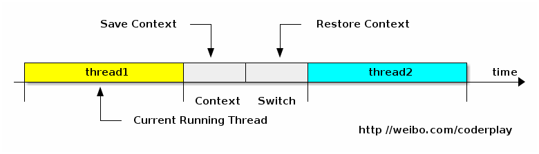

# 从Java视角理解系统结构(一)CPU上下文切换
在高性能编程时,经常接触到多线程. 起初我们的理解是, 多个线程并行地执行总比单个线程要快, 就像多个人一起干活总比一个人干要快. 然而实际情况是, 多线程之间需要竞争IO设备, 或者竞争锁资源，导致往往执行速度还不如单个线程. 在这里有一个经常提及的概念就是: 上下文切换(Context Switch).

上下文切换的精确定义可以参考: http://www.linfo.org/context_switch.html。下面做个简单的介绍. 多任务系统往往需要同时执行多道作业.作业数往往大于机器的CPU数, 然而一颗CPU同时只能执行一项任务, 如何让用户感觉这些任务正在同时进行呢? 操作系统的设计者巧妙地利用了时间片轮转的方式, CPU给每个任务都服务一定的时间, 然后把当前任务的状态保存下来, 在加载下一任务的状态后, 继续服务下一任务. 任务的状态保存及再加载, 这段过程就叫做上下文切换. 时间片轮转的方式使多个任务在同一颗CPU上执行变成了可能, 但同时也带来了保存现场和加载现场的直接消耗。

(Note. 更精确地说, 上下文切换会带来直接和间接两种因素影响程序性能的消耗. 直接消耗包括: CPU寄存器需要保存和加载, 系统调度器的代码需要执行, TLB实例需要重新加载, CPU 的pipeline需要刷掉; 间接消耗指的是多核的cache之间得共享数据, 间接消耗对于程序的影响要看线程工作区操作数据的大小).

在linux中可以使用vmstat观察上下文切换的次数. 执行命令如下:

     $ vmstat 1
     procs -----------memory---------- ---swap-- -----io---- -system-- ----cpu----
      r  b   swpd   free   buff  cache   si   so    bi    bo   in   cs us sy id wa
      1  0      0 4593944 453560 1118192    0    0    14    12  238   30  6  1 92  1
      0  0      0 4593212 453568 1118816    0    0     0    96  958 1108  4  1 94  2
      0  0      0 4593360 453568 1118456    0    0     0     0  895 1044  3  1 95  0
      1  0      0 4593408 453568 1118456    0    0     0     0  929 1073  4  1 95  0
      0  0      0 4593496 453568 1118456    0    0     0     0 1133 1363  6  1 93  0
      0  0      0 4593568 453568 1118476    0    0     0     0  992 1190  4  1 95  0

vmstat 1指每秒统计一次, 其中cs列就是指上下文切换的数目. 一般情况下, 空闲系统的上下文切换每秒大概在1500以下.

对于我们经常使用的抢占式操作系统来说, 引起上下文切换的原因大概有以下几种: 1. 当前执行任务的时间片用完之后, 系统CPU正常调度下一个任务 2. 当前执行任务碰到IO阻塞, 调度器将挂起此任务, 继续下一任务 3. 多个任务抢占锁资源, 当前任务没有抢到,被调度器挂起, 继续下一任务 4. 用户代码挂起当前任务, 让出CPU时间 5. 硬件中断. 前段时间发现有人在使用futex的WAIT和WAKE来测试context switch的直接消耗(链接), 也有人使用阻塞IO来测试context switch的消耗(链接).那么Java程序怎么测试和观察上下文切换的消耗呢?

我做了一个小实验, 代码很简单, 有两个工作线程. 开始时，第一个线程挂起自己; 第二个线程唤醒第一个线程，再挂起自己; 第一个线程醒来之后唤醒第二个线程, 再挂起自己. 就这样一来一往,互相唤醒对方, 挂起自己. 代码如下:

     import java.util.concurrent.atomic.AtomicReference;
     import java.util.concurrent.locks.LockSupport;
     
     public final class ContextSwitchTest {
     	static final int RUNS = 3;
     	static final int ITERATES = 1000000;
     	static AtomicReference turn = new AtomicReference();
     
     	static final class WorkerThread extends Thread {
     		volatile Thread other;
     		volatile int nparks;
     
     		public void run() {
     			final AtomicReference t = turn;
     			final Thread other = this.other;
     			if (turn == null || other == null)
     				throw new NullPointerException();
     			int p = 0;
     			for (int i = 0; i < ITERATES; ++i) {
     				while (!t.compareAndSet(other, this)) {
     					LockSupport.park();
     					++p;
     				}
     				LockSupport.unpark(other);
     			}
     			LockSupport.unpark(other);
     			nparks = p;
     			System.out.println("parks: " + p);
     
     		}
     	}
     
     	static void test() throws Exception {
     		WorkerThread a = new WorkerThread();
     		WorkerThread b = new WorkerThread();
     		a.other = b;
     		b.other = a;
     		turn.set(a);
     		long startTime = System.nanoTime();
     		a.start();
     		b.start();
     		a.join();
     		b.join();
     		long endTime = System.nanoTime();
     		int parkNum = a.nparks + b.nparks;
     		System.out.println("Average time: " + ((endTime - startTime) / parkNum)
     				+ "ns");
     	}
     
     	public static void main(String[] args) throws Exception {
     		for (int i = 0; i < RUNS; i++) {
     			test();
     		}
     	}
     }

编译后,在我自己的笔记本上( Intel(R) Core(TM) i5 CPU M 460 @ 2.53GHz, 2 core, 3M L3 Cache) 用测试几轮，结果如下:

     java -cp . ContextSwitchTest
     parks: 953495
     parks: 953485
     Average time: 11373ns
     parks: 936305
     parks: 936302
     Average time: 11975ns
     parks: 965563
     parks: 965560
     Average time: 13261ns

我们会发现这么简单的for循环, 线性执行会非常快,不需要1秒, 而执行这段程序需要几十秒的耗时. 每个上下文切换需要耗去十几us的时间,这对于程序吞吐量的影响很大.

同时我们可以执行vmstat 1 观查一下上下文切换的频率是否变快

     $ vmstat 1
     procs -----------memory---------- ---swap-- -----io---- -system-- ----cpu----
      r  b   swpd   free   buff  cache   si   so    bi    bo   in   cs us sy id wa
      1  0      0 4424988 457964 1154912    0    0    13    12  252   80  6  1 92  1
      0  0      0 4420452 457964 1159900    0    0     0     0 1586 2069  6  1 93  0
      1  0      0 4407676 457964 1171552    0    0     0     0 1436 1883  8  3 89  0
      1  0      0 4402916 457964 1172032    0    0     0    84 22982 45792  9  4 85  2
      1  0      0 4416024 457964 1158912    0    0     0     0 95382 198544 17 10 73  0
      1  1      0 4416096 457964 1158968    0    0     0   116 79973 159934 18  7 74  0
      1  0      0 4420384 457964 1154776    0    0     0     0 96265 196076 15 10 74  1
      1  0      0 4403012 457972 1171096    0    0     0   152 104321 213537 20 12 66  2

再使用strace观察以上程序中Unsafe.park()究竟是哪道系统调用造成了上下文切换:
     
     $strace -f java -cp . ContextSwitchTest
     [pid  5969] futex(0x9571a9c, FUTEX_WAKE_OP_PRIVATE, 1, 1, 0x9571a98, {FUTEX_OP_SET, 0, FUTEX_OP_CMP_GT, 1}) = 1
     [pid  5968]  )       = 0
     [pid  5969] futex(0x9571ad4, FUTEX_WAIT_PRIVATE, 949, NULL
     [pid  5968] futex(0x9564368, FUTEX_WAKE_PRIVATE, 1) = 0
     [pid  5968] futex(0x9571ad4, FUTEX_WAKE_OP_PRIVATE, 1, 1, 0x9571ad0, {FUTEX_OP_SET, 0, FUTEX_OP_CMP_GT, 1}
     [pid  5969]  )       = 0
     [pid  5968]  )       = 1
     [pid  5969] futex(0x9571628, FUTEX_WAIT_PRIVATE, 2, NULL

果然还是futex.

再使用perf看看上下文对于Cache的影响:

     $ perf stat -e cache-misses   java -cp . ContextSwitchTest
     parks: 999999
     parks: 1000000
     Average time: 16201ns
     parks: 998930
     parks: 998926
     Average time: 14426ns
     parks: 998034
     parks: 998204
     Average time: 14489ns
     
      Performance counter stats for 'java -cp . ContextSwitchTest':
     
              2,550,605 cache-misses
     
           90.221827008 seconds time elapsed

1分半钟内有255万多次cache未命中.

嗯, 貌似太长了, 可以结束了. 接下来会继续几篇博文继续分析一些有意思的东西.
(1) 从Java视角看内存屏障 (Memory Barrier)
(2) 从java视角看CPU亲缘性 (CPU Affinity)
等..敬请关注

PS. 其实还做了一个实验, 测试CPU Affinity对于Context Switch的影响.

     $ taskset -c 0 java -cp . ContextSwitchTest
     parks: 992713
     parks: 1000000
     Average time: 2169ns
     parks: 978428
     parks: 1000000
     Average time: 2196ns
     parks: 989897
     parks: 1000000
     Average time: 2214ns

这个命令把进程绑定在0号CPU上,结果Context Switch的消耗小了一个数量级, 什么原因呢? 卖个关子, 在谈到CPU Affinity的博文再说 :)。

