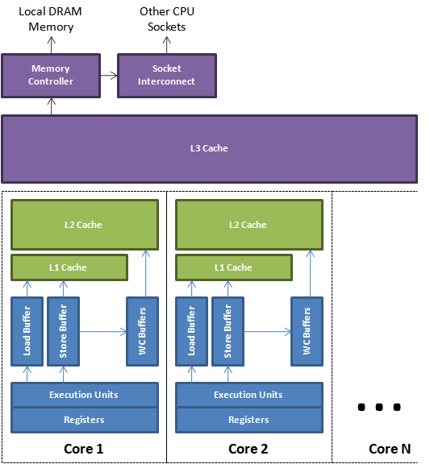

# 从Java视角理解系统结构（三）伪共享

从我的前一篇博文中, 我们知道了CPU缓存及缓存行的概念, 同时用一个例子说明了编写单线程Java代码时应该注意的问题. 下面我们讨论更为复杂, 而且更符合现实情况的多核编程时将会碰到的问题. 这些问题更容易犯, 连j.u.c包作者Doug Lea大师的JDK代码里也存在这些问题.

## MESI协议及RFO请求
从前一篇我们知道, 典型的CPU微架构有3级缓存, 每个核都有自己私有的L1, L2缓存. 那么多线程编程时, 另外一个核的线程想要访问当前核内L1, L2 缓存行的数据, 该怎么办呢?
有人说可以通过第2个核直接访问第1个核的缓存行. 这是可行的, 但这种方法不够快. 跨核访问需要通过Memory Controller(见上一篇的示意图), 典型的情况是第2个核经常访问第1个核的这条数据, 那么每次都有跨核的消耗. 更糟的情况是, 有可能第2个核与第1个核不在一个插槽内.况且Memory Controller的总线带宽是有限的, 扛不住这么多数据传输. 所以, CPU设计者们更偏向于另一种办法: 如果第2个核需要这份数据, 由第1个核直接把数据内容发过去, 数据只需要传一次。

那么什么时候会发生缓存行的传输呢? 答案很简单: 当一个核需要读取另外一个核的脏缓存行时发生. 但是前者怎么判断后者的缓存行已经被弄脏(写)了呢?

下面将详细地解答以上问题. 首先我们需要谈到一个协议–MESI协议(链接). 现在主流的处理器都是用它来保证缓存的相干性和内存的相干性. M,E,S和I代表使用MESI协议时缓存行所处的四个状态:

- M(修改, Modified): 本地处理器已经修改缓存行, 即是脏行, 它的内容与内存中的内容不一样. 并且此cache只有本地一个拷贝(专有).
- E(专有, Exclusive): 缓存行内容和内存中的一样, 而且其它处理器都没有这行数据
- S(共享, Shared): 缓存行内容和内存中的一样, 有可能其它处理器也存在此缓存行的拷贝
- I(无效, Invalid): 缓存行失效, 不能使用

上图源自于内核开发者Ulrich Drepper著名的What Every Programmer Should Know About Memory一书(下载), 简要地展示了缓存行的四种状态转换. 不过他的书中没有说明白这四个状态是怎么转换的, 下面我用小段文字来说明一下.

初始 一开始时, 缓存行没有加载任何数据, 所以它处于I状态.
- 本地写(Local Write)如果本地处理器写数据至处于I状态的缓存行, 则缓存行的状态变成M.
- 本地读(Local Read) 如果本地处理器读取处于I状态的缓存行, 很明显此缓存没有数据给它. 此时分两种情况: (1)其它处理器的缓存里也没有此行数据, 则从内存加载数据到此缓存行后, 再将它设成E状态, 表示只有我一家有这条数据, 其它处理器都没有 (2)其它处理器的缓存有此行数据, 则将此缓存行的状态设为S状态.

P.S.如果处于M状态的缓存行, 再由本地处理器写入/读出, 状态是不会改变的.

远程读(Remote Read) 假设我们有两个处理器c1和c2. 如果c2需要读另外一个处理器c1的缓存行内容, c1需要把它缓存行的内容通过内存控制器(Memory Controller)发送给c2, c2接到后将相应的缓存行状态设为S. 在设置之前, 内存也得从总线上得到这份数据并保存.

远程写(Remote Write) 其实确切地说不是远程写, 而是c2得到c1的数据后, 不是为了读, 而是为了写. 也算是本地写, 只是c1也拥有这份数据的拷贝, 这该怎么办呢? c2将发出一个RFO(Request For Owner)请求, 它需要拥有这行数据的权限, 其它处理器的相应缓存行设为I, 除了它自已, 谁不能动这行数据. 这保证了数据的安全, 同时处理RFO请求以及设置I的过程将给写操作带来很大的性能消耗.

以上只是列举了一些状态转换, 为下文做铺垫. 如果全部描述,需要非常大量的文字, 大家参考这张图就知道原因了, 可以通过此图了解MESI协议更详细的信息.

## 伪共享
我们从上节知道, 写操作的代价很高, 特别当需要发送RFO消息时. 我们编写程序时, 什么时候会发生RFO请求呢? 有以下两种:
1. 线程的工作从一个处理器移到另一个处理器, 它操作的所有缓存行都需要移到新的处理器上. 此后如果再写缓存行, 则此缓存行在不同核上有多个拷贝, 需要发送RFO请求了.
2. 两个不同的处理器确实都需要操作相同的缓存行

由上一篇我们知道, 在Java程序中,数组的成员在缓存中也是连续的. 其实从Java对象的相邻成员变量也会加载到同一缓存行中. 如果多个线程操作不同的成员变量, 但是相同的缓存行, 伪共享(False Sharing)问题就发生了. 下面引用Disruptor项目Lead的博文中的示例图和实验例子(偷会懒,但会加上更详细的profile方法).

一个运行在处理器core 1上的线程想要更新变量X的值, 同时另外一个运行在处理器core 2上的线程想要更新变量Y的值. 但是, 这两个频繁改动的变量都处于同一条缓存行. 两个线程就会轮番发送RFO消息, 占得此缓存行的拥有权. 当core 1取得了拥有权开始更新X, 则core 2对应的缓存行需要设为I状态. 当core 2取得了拥有权开始更新Y, 则core 1对应的缓存行需要设为I状态(失效态). 轮番夺取拥有权不但带来大量的RFO消息, 而且如果某个线程需要读此行数据时, L1和L2缓存上都是失效数据, 只有L3缓存上是同步好的数据.从前一篇我们知道, 读L3的数据非常影响性能. 更坏的情况是跨槽读取, L3都要miss,只能从内存上加载.

表面上X和Y都是被独立线程操作的, 而且两操作之间也没有任何关系.只不过它们共享了一个缓存行, 但所有竞争冲突都是来源于共享.

## 实验及分析
引用Martin的例子, 稍做修改,代码如下:

     public final class FalseSharing implements Runnable {
     	public static int NUM_THREADS = 4; // change
     	public final static long ITERATIONS = 500L * 1000L * 1000L;
     	private final int arrayIndex;
     	private static VolatileLong[] longs;
     
     	public FalseSharing(final int arrayIndex) {
     		this.arrayIndex = arrayIndex;
     	}
     
     	public static void main(final String[] args) throws Exception {
     		Thread.sleep(10000);
     		System.out.println("starting....");
     		if (args.length == 1) {
     			NUM_THREADS = Integer.parseInt(args[0]);
     		}
     
     		longs = new VolatileLong[NUM_THREADS];
     		for (int i = 0; i < longs.length; i++) {
     			longs[i] = new VolatileLong();
     		}
     		final long start = System.nanoTime();
     		runTest();
     		System.out.println("duration = " + (System.nanoTime() - start));
     	}
     
     	private static void runTest() throws InterruptedException {
     		Thread[] threads = new Thread[NUM_THREADS];
     		for (int i = 0; i < threads.length; i++) {
     			threads[i] = new Thread(new FalseSharing(i));
     		}
     		for (Thread t : threads) {
     			t.start();
     		}
     		for (Thread t : threads) {
     			t.join();
     		}
     	}
     
     	public void run() {
     		long i = ITERATIONS + 1;
     		while (0 != --i) {
     			longs[arrayIndex].value = i;
     		}
     	}
     
     	public final static class VolatileLong {
     		public volatile long value = 0L;
     		public long p1, p2, p3, p4, p5, p6; // 注释
     	}
     }

代码的逻辑是默认4个线程修改一数组不同元素的内容.  元素的类型是VolatileLong, 只有一个长整型成员value和6个没用到的长整型成员. value设为volatile是为了让value的修改所有线程都可见. 在一台Westmere(Xeon E5620 8core*2)机器上跑一下看

     $ java FalseSharing
     starting....
     duration = 9316356836

把以上代码49行注释掉, 看看结果:

     $ java FalseSharing
     starting....
     duration = 59791968514

两个逻辑一模一样的程序, 前者只需要9秒, 后者跑了将近一分钟, 这太不可思议了! 我们用伪共享(False Sharing)的理论来分析一下. 后面的那个程序longs数组的4个元素,由于VolatileLong只有1个长整型成员, 所以整个数组都将被加载至同一缓存行, 但有4个线程同时操作这条缓存行, 于是伪共享就悄悄地发生了. 读者可以测试一下2,4,8, 16个线程分别操作时分别是什么效果, 什么样的趋势.

那么怎么避免伪共享呢? 我们未注释的代码就告诉了我们方法. 我们知道一条缓存行有64字节, 而Java程序的对象头固定占8字节(32位系统)或12字节(64位系统默认开启压缩, 不开压缩为16字节), 详情见 链接. 我们只需要填6个无用的长整型补上6*8=48字节, 让不同的VolatileLong对象处于不同的缓存行, 就可以避免伪共享了(64位系统超过缓存行的64字节也无所谓,只要保证不同线程不要操作同一缓存行就可以). 这个办法叫做补齐(Padding).

如何从系统层面观察到这种优化是切实有效的呢? 很可惜, 由于很多计算机的微架构不同, 我们没有工具来直接探测伪共享事件(包括Intel Vtune和Valgrind). 所有的工具都是从侧面来发现的, 下面通过Linux利器OProfile来证明一下. 上面的程序的数组只是占64 * 4 = 256字节, 而且在连续的物理空间, 照理来说数据会在L1缓存上就命中, 肯定不会传入到L2缓存中, 只有在伪共享发生时才会出现. 于是, 我们可以通过观察L2缓存的IN事件就可以证明了,步骤如下:

     # 设置捕捉L2缓存IN事件
     $ sudo  opcontrol --setup --event=L2_LINES_IN:100000
     # 清空工作区
     $ sudo opcontrol --reset
     # 开始捕捉
     $ sudo opcontrol --start
     # 运行程序
     $ java FalseSharing
     # 程序跑完后, dump捕捉到的数据
     $ sudo opcontrol --dump
     # 停止捕捉
     $ sudo opcontrol -h
     # 报告结果
     $ opreport -l `which java`

比较一下两个版本的结果, 慢的版本:

     $ opreport -l `which java`
     CPU: Intel Westmere microarchitecture, speed 2400.2 MHz (estimated)
     Counted L2_LINES_IN events (L2 lines alloacated) with a unit mask of 0x07 (any L2 lines alloacated) count 100000
     samples  %        image name               symbol name
     34085    99.8447  anon (tgid:18051 range:0x7fcdee53d000-0x7fcdee7ad000) anon (tgid:18051 range:0x7fcdee53d000-0x7fcdee7ad000)
     51        0.1494  anon (tgid:16054 range:0x7fa485722000-0x7fa485992000) anon (tgid:16054 range:0x7fa485722000-0x7fa485992000)
     2         0.0059  anon (tgid:2753 range:0x7f43b317e000-0x7f43b375e000) anon (tgid:2753 range:0x7f43b317e000-0x7f43b375e000)

快的版本:

     $ opreport -l `which java`
     CPU: Intel Westmere microarchitecture, speed 2400.2 MHz (estimated)
     Counted L2_LINES_IN events (L2 lines alloacated) with a unit mask of 0x07 (any L2 lines alloacated) count 100000
     samples  %        image name               symbol name
     22       88.0000  anon (tgid:18873 range:0x7f3e3fa8a000-0x7f3e3fcfa000) anon (tgid:18873 range:0x7f3e3fa8a000-0x7f3e3fcfa000)
     3        12.0000  anon (tgid:2753 range:0x7f43b317e000-0x7f43b375e000) anon (tgid:2753 range:0x7f43b317e000-0x7f43b375e000)

慢的版本由于False Sharing引发的L2缓存IN事件达34085次, 而快版本的为0次.

## 总结
伪共享在多核编程中很容易发生, 而且比较隐蔽. 例如, 在JDK的LinkedBlockingQueue中, 存在指向队列头的引用head和指向队列尾的引用last. 而这种队列经常在异步编程中使有,这两个引用的值经常的被不同的线程修改, 但它们却很可能在同一个缓存行, 于是就产生了伪共享. 线程越多, 核越多,对性能产生的负面效果就越大.

某些Java编译器会将没有使用到的补齐数据, 即示例代码中的6个长整型在编译时优化掉, 可以在程序中加入一些代码防止被编译优化。

     public static long preventFromOptimization(VolatileLong v) {
         return v.p1 + v.p2 + v.p3 + v.p4 + v.p5 + v.p6;
     }

另外, 由于Java的GC问题. 数据在内存和对应的CPU缓存行的位置有可能发生变化, 所以在使用pad的时候应该注意GC的影响.

