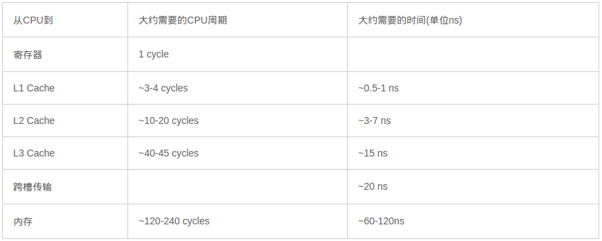

# 从Java视角理解系统结构（二）CPU缓存

众所周知, CPU是计算机的大脑, 它负责执行程序的指令; 内存负责存数据, 包括程序自身数据. 同样大家都知道, 内存比CPU慢很多. 其实在30年前, CPU的频率和内存总线的频率在同一个级别, 访问内存只比访问CPU寄存器慢一点儿. 由于内存的发展都到技术及成本的限制, 现在获取内存中的一条数据大概需要200多个CPU周期(CPU cycles), 而CPU寄存器一般情况下1个CPU周期就够了.

## CPU缓存
网页浏览器为了加快速度,会在本机存缓存以前浏览过的数据; 传统数据库或NoSQL数据库为了加速查询, 常在内存设置一个缓存, 减少对磁盘(慢)的IO. 同样内存与CPU的速度相差太远, 于是CPU设计者们就给CPU加上了缓存(CPU Cache). 如果你需要对同一批数据操作很多次, 那么把数据放至离CPU更近的缓存, 会给程序带来很大的速度提升. 例如, 做一个循环计数, 把计数变量放到缓存里,就不用每次循环都往内存存取数据了. 下面是CPU Cache的简单示意图.

随着多核的发展, CPU Cache分成了三个级别: L1, L2, L3. 级别越小越接近CPU, 所以速度也更快, 同时也代表着容量越小. L1是最接近CPU的, 它容量最小, 例如32K, 速度最快,每个核上都有一个L1 Cache(准确地说每个核上有两个L1 Cache, 一个存数据 L1d Cache, 一个存指令 L1i Cache). L2 Cache 更大一些,例如256K, 速度要慢一些, 一般情况下每个核上都有一个独立的L2 Cache; L3 Cache是三级缓存中最大的一级,例如12MB,同时也是最慢的一级, 在同一个CPU插槽之间的核共享一个L3 Cache.

感兴趣的同学可以在Linux下面用cat /proc/cpuinfo, 或Ubuntu下lscpu看看自己机器的缓存情况, 更细的可以通过以下命令看看:

     $ cat /sys/devices/system/cpu/cpu0/cache/index0/size
     32K
     $ cat /sys/devices/system/cpu/cpu0/cache/index0/type
     Data
     $ cat /sys/devices/system/cpu/cpu0/cache/index0/level
     1
     $ cat /sys/devices/system/cpu/cpu3/cache/index3/level
     3

就像数据库cache一样, 获取数据时首先会在最快的cache中找数据, 如果没有命中(Cache miss) 则往下一级找, 直到三层Cache都找不到,那只要向内存要数据了. 一次次地未命中,代表取数据消耗的时间越长.

## 缓存行(Cache line)
为了高效地存取缓存, 不是简单随意地将单条数据写入缓存的.  缓存是由缓存行组成的, 典型的一行是64字节. 读者可以通过下面的shell命令,查看cherency_line_size就知道知道机器的缓存行是多大.

     $ cat /sys/devices/system/cpu/cpu0/cache/index0/coherency_line_size
      64

CPU存取缓存都是按行为最小单位操作的. 在这儿我将不提及缓存的associativity问题, 将问题简化一些. 一个Java long型占8字节, 所以从一条缓存行上你可以获取到8个long型变量. 所以如果你访问一个long型数组, 当有一个long被加载到cache中, 你将无消耗地加载了另外7个. 所以你可以非常快地遍历数组.

## 实验及分析
我们在Java编程时, 如果不注意CPU Cache, 那么将导致程序效率低下. 例如以下程序, 有一个二维long型数组, 在我的32位笔记本上运行时的内存分布如图:

32位机器中的java的数组对象头共占16字节, 加上62个long型一行long数据一共占512字节. 所以这个二维数据是顺序排列的.

     public class L1CacheMiss {
         private static final int RUNS = 10;
         private static final int DIMENSION_1 = 1024 * 1024;
         private static final int DIMENSION_2 = 62;
      
         private static long[][] longs;
      
         public static void main(String[] args) throws Exception {
             Thread.sleep(10000);
             longs = new long[DIMENSION_1][];
             for (int i = 0; i < DIMENSION_1; i++) {
                 longs[i] = new long[DIMENSION_2];
                 for (int j = 0; j < DIMENSION_2; j++) {
                     longs[i][j] = 0L;
                 }
             }
             System.out.println("starting....");
      
             final long start = System.nanoTime();
             long sum = 0L;
             for (int r = 0; r < RUNS; r++) {
                 // for (int j = 0; j < DIMENSION_2; j++) {
                     // for (int i = 0; i < DIMENSION_1; i++) {
                         // sum += longs[i][j];
                     // }
                 // }
      
                 for (int i = 0; i < DIMENSION_1; i++) {
                     for (int j = 0; j < DIMENSION_2; j++) {
                         sum += longs[i][j];
                     }
                 }
             }
             System.out.println("duration = " + (System.nanoTime() - start));
         }
     }

编译后运行,结果如下

     $ java L1CacheMiss
     starting....
     duration = 1460583903

然后我们将22-26行的注释取消, 将28-32行注释, 编译后再次运行,结果是不是比我们预想得还糟?

     $ java L1CacheMiss
     starting....
     duration = 22332686898

前面只花了1.4秒的程序, 只做一行的对调要运行22秒. 从上节我们可以知道在加载longs[i][j]时, longs[i][j+1]很可能也会被加载至cache中, 所以立即访问longs[i][j+1]将会命中L1 Cache, 而如果你访问longs[i+1][j]情况就不一样了, 这时候很可能会产生 cache miss导致效率低下.

下面我们用perf来验证一下,先将快的程序跑一下.
     
     $ perf stat -e L1-dcache-load-misses java L1CacheMiss
     starting....
     duration = 1463011588
     
     Performance counter stats for 'java L1CacheMiss':
     
     164,625,965 L1-dcache-load-misses
     
     13.273572184 seconds time elapsed

一共164,625,965次L1 cache miss, 再看看慢的程序

     $ perf stat -e L1-dcache-load-misses java L1CacheMiss
     starting....
     duration = 21095062165
     
     Performance counter stats for 'java L1CacheMiss':
     
     1,421,402,322 L1-dcache-load-misses
     
     32.894789436 seconds time elapsed

这回产生了1,421,402,322次 L1-dcache-load-misses, 所以慢多了.

以上我只是示例了在L1 Cache满了之后才会发生的cache miss. 其实cache miss的原因有下面三种:
1. 第一次访问数据, 在cache中根本不存在这条数据, 所以cache miss, 可以通过prefetch解决.
2. cache冲突, 需要通过补齐来解决.
3. 就是我示例的这种, cache满, 一般情况下我们需要减少操作的数据大小, 尽量按数据的物理顺序访问数据.

